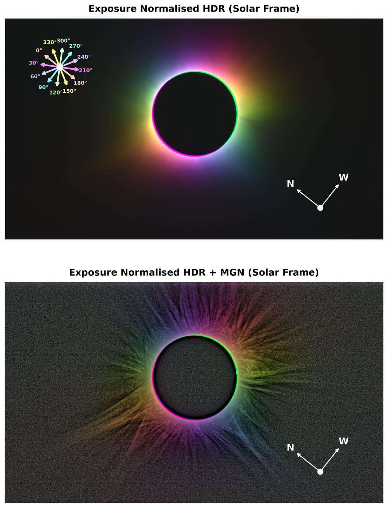
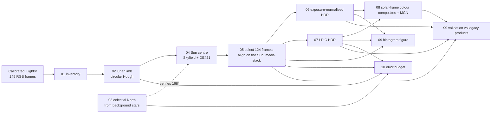
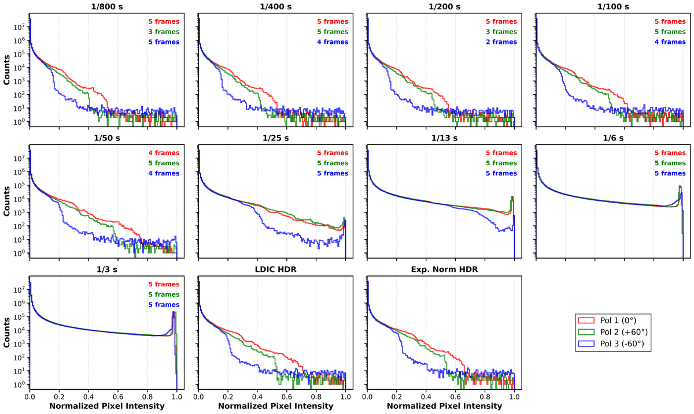

# Paper I — Linear polarimetry of the 2024 eclipse corona

End-to-end pipeline for *Linear Polarimetry of the Solar Corona during the Total
Solar Eclipse of 8 April 2024: Multi-Band Observations and HDR Imaging*
(Singh, Sharma, Arora, Burman & Gandhi). Starting from the calibrated light
frames it regenerates every table and figure of the paper, and it validates
each product against the files that went into the submitted manuscript.

<p align="center">
  
  
</p>

## Pipeline



| notebook | what it does | output |
|---|---|---|
| `00_constants` | prints `config.py`, recomputes the P-angle (SunPy) and the plate scale | — |
| `01_frame_inventory` | header census of the calibrated frames, IST → UTC | `products/frame_inventory.csv` |
| `02_moon_center_cht` | two-pass circular Hough transform on every frame (~75 min) | `products/moon_centers.csv` |
| `03_celestial_north_from_stars` | detects ζ Psc / 88 Psc, fits the North angle and plate scale, star-field check | `products/celestial_north_*.csv`, 2 figures |
| `04_sun_center_skyfield` | Sun centre from the Moon centre + topocentric ephemeris | `products/sun_moon_centers.csv` |
| `05_select_align_stack` | 1-σ lunar-radius filter, Sun-centric alignment, mean stack per polariser × exposure | `products/stacked/stacked_exp{N}.fits`, appendix table |
| `06_hdr_exposure_normalization` | HDR by exposure normalisation | `products/hdr/hdr_expnorm_pol{1,2,3}.fits` |
| `07_hdr_ldic` | HDR by the Linear Digital Image Composer ([docs/LDIC.md](docs/LDIC.md)) | `products/hdr/hdr_ldic_pol{1,2,3}.fits` |
| `08_paper_figures` | Stokes rotation to the solar frame, colour composites, MGN — Figs. 6 & 7 | `figures/{expnorm,ldic}_hdr_solar_frame.png` |
| `09_histogram_figure` | Fig. 8 in the paper's layout and in a conventional layout | `figures/histogram_normalized_exposures_{vertical,horizontal}.{png,pdf}` |
| `10_error_budget` | uncertainty of every step ([docs/ERROR_BUDGET.md](docs/ERROR_BUDGET.md)) | `products/error_budget.csv`, figures |
| `99_validate_against_legacy` | correlations with the products that went into the paper | `products/validation_report.csv` |

`config.py` holds every path and constant; `utils.py` every algorithm. The
notebooks are thin and can be run in order with `./run_all.sh` (executed copies
land in `products/executed/`).

## Setup

```bash
uv venv --python 3.12 ~/.venvs/solar-corona
uv pip install --python ~/.venvs/solar-corona/bin/python -r requirements.txt
cp local_paths.example.toml local_paths.toml     # point data_root at the folder holding Calibrated_Lights/
./run_all.sh                                     # or: ./run_all.sh 05 06 07 08
```

Two switches in `config.py`:

* `SUN_CENTER_ROTATION` — `"astrometric"` (default; the convention validated on the
  star field) or `"legacy"` (the original convention, which reproduces the
  submitted figures together with the by-eye channel shifts).
* `MOON_CENTERS_SOURCE` — `"legacy"` (the 2024 CHT table, default) or `"recomputed"`.

## How well does it reproduce the paper?

In legacy mode every stacked plane matches the paper's at corr ≥ 0.9997, the
HDR products at ≥ 0.99995 and the figures at ≥ 0.998 (see
[docs/PROVENANCE.md](docs/PROVENANCE.md)). In the default astrometric mode the
three polariser channels are registered to ≲ 1 px without manual shifts; the
numbers for the current run are in `products/validation_report.csv`.

<p align="center">
  
</p>

## Documents

* [docs/PROVENANCE.md](docs/PROVENANCE.md) — which legacy notebook produced which figure; how the stacking recipe was recovered
* [docs/DISCREPANCIES.md](docs/DISCREPANCIES.md) — what turned out to be wrong or inconsistent, with evidence and impact
* [docs/ERROR_BUDGET.md](docs/ERROR_BUDGET.md) — per-step uncertainties (generated by notebook 10)
* [docs/LDIC.md](docs/LDIC.md) — how the Linear Digital Image Composer is used here, in detail
* [docs/ARCHIVE.md](docs/ARCHIVE.md) — every legacy notebook on the data SSD and its status

## Key numbers

| | |
|---|---|
| celestial North | 168.0 ± 0.1° CCW from +x (Stellarium overlay; confirmed by the stars) |
| solar P-angle | −26.24° |
| plate scale | 1.500″/px (stars); the CHT lunar radius runs 0.5 % small |
| frames | 145 taken, 136 polarimetric, 130 pass the 1-σ filter, **124** in the stacks |
| Sun centre in products | array centre (4128, 2752) |
| PSF | FWHM ≈ 10 px ≈ 14″ |
