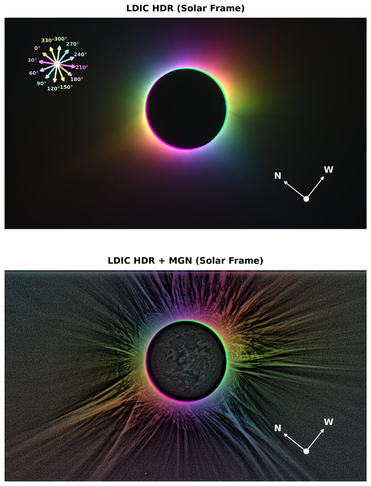
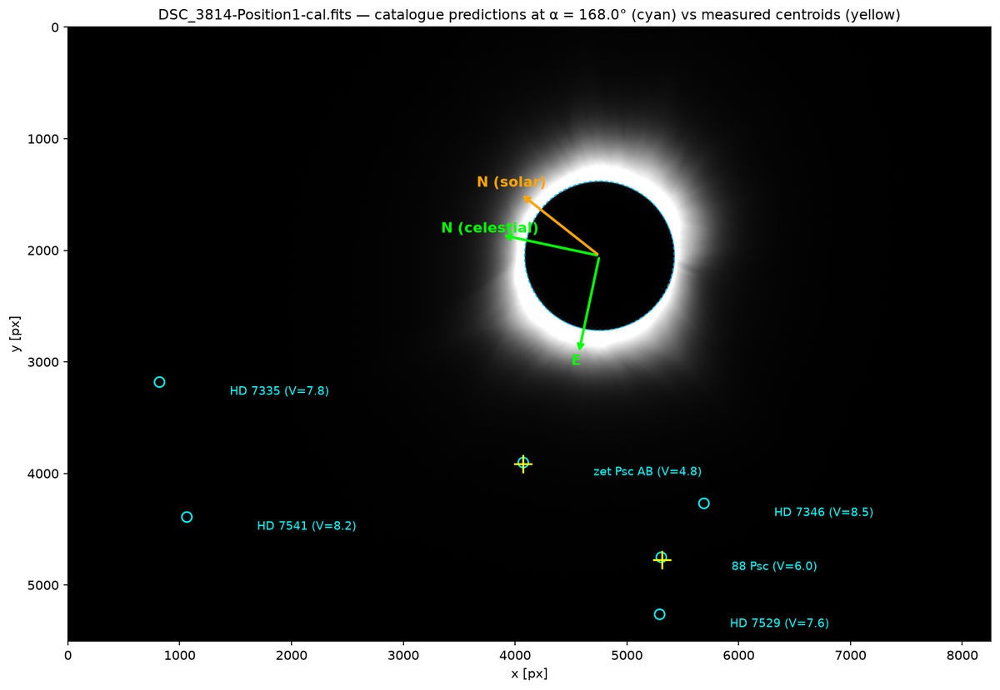

# solar-corona-analysis

Analysis code for the **total solar eclipse of 8 April 2024**, observed from
Dallas, Texas with an 80 mm refractor, a Nikon Z7 II and three linear polarisers
(0°, +60°, −60°) over a nine-step exposure bracket (1/800 – 1/3 s).

| folder | paper | status |
|---|---|---|
| [`Paper-I-Analysis/`](Paper-I-Analysis/) | Singh, Sharma, Arora, Burman & Gandhi — *Linear Polarimetry of the Solar Corona during the Total Solar Eclipse of 8 April 2024: Multi-Band Observations and HDR Imaging* | complete, reproduces every figure of the paper |
| `Paper-II-Analysis/` | polarised brightness and electron-density inversion | not yet migrated |

<p align="center">
  
  
</p>

## Quick start

```bash
git clone https://github.com/timedilatesme/solar-corona-analysis.git
cd solar-corona-analysis

# environment (Python 3.12; uv shown, pip works too)
uv venv --python 3.12 ~/.venvs/solar-corona
uv pip install --python ~/.venvs/solar-corona/bin/python -r Paper-I-Analysis/requirements.txt

# tell the code where the calibrated frames are (or set $SOLAR_ECLIPSE_DATA_ROOT)
cp Paper-I-Analysis/local_paths.example.toml Paper-I-Analysis/local_paths.toml   # then edit

cd Paper-I-Analysis && ./run_all.sh        # or open the notebooks in Jupyter
```

## Data

The calibrated light frames (145 × 545 MB, Astro Pixel Processor output) and the
intermediate products are **not in this repository**. `config.py` reads the
data root from `$SOLAR_ECLIPSE_DATA_ROOT`, from `local_paths.toml`, or falls
back to the authors' SSD path; everything the pipeline generates goes to
`Paper-I-Analysis/products/` and `Paper-I-Analysis/figures/` (git-ignored).
Data are available from the corresponding author on reasonable request.

## Documentation

* [`Paper-I-Analysis/README.md`](Paper-I-Analysis/README.md) — the pipeline, notebook by notebook
* [`Paper-I-Analysis/docs/`](Paper-I-Analysis/docs/) — provenance, legacy-code archive, discrepancies, LDIC description, error budget
* [`CLAUDE.md`](CLAUDE.md) — orientation notes for AI-assisted sessions (conventions, environment, open items)

## Citation

Singh, S., Sharma, P., Arora, B., Burman, S., Gandhi, C.: *Linear Polarimetry of
the Solar Corona during the Total Solar Eclipse of 8 April 2024: Multi-Band
Observations and HDR Imaging*, Solar Physics (submitted).
